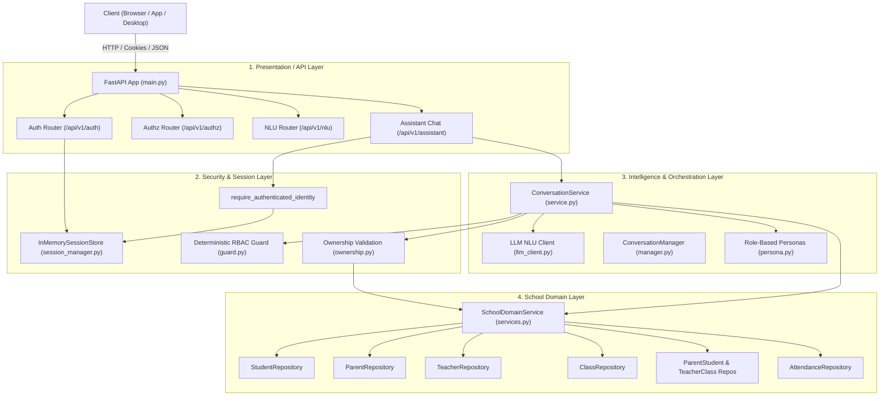

<!-- docs/architecture.md -->
# Architecture

## Layer Separation

The application follows a clean, decoupled layered architecture adhering to Domain-Driven Design (DDD) and Zero-Trust AI security principles:

---

## Key Architecture Layers

### 1. Presentation / API Layer
* **Framework:** FastAPI with asynchronous endpoint routing.
* **Endpoints:**
  * `/api/v1/auth`: Login, current user (`/me`), and logout.
  * `/api/v1/authz`: Session-backed permission checks (`/authorize`) and development checks (`/check`).
  * `/api/v1/assistant/chat`: Conversational school assistant endpoint.
  * `/api/v1/nlu/analyze`: Direct NLU analysis endpoint.
  * `/health`: Health status checkpoint.

### 2. Security & Session Layer
* **Session Management:** Cryptographically random session tokens (`secrets.token_urlsafe(32)`) delivered via `HttpOnly`, `SameSite=Lax` cookies or `X-Session-ID` headers.
* **Deterministic RBAC:** Strict role-to-permission mapping (`ROLE_PERMISSIONS`) evaluated independently of user messages or LLM outputs.
* **Ownership Validation:** Multi-tenant access controls ensuring students, parents, and teachers can only access their authorized records.

### 3. Intelligence & Conversation Layer
* **NLU Pipeline:** Formulates prompts for configured LLM providers (e.g., DeepSeek, OpenAI-compatible), structured entity extraction, and intent classification adhering to [Intent](file:///c:/Users/patha/OneDrive/Desktop/XYZ_ai/backend/app/nlu/intents.py).
* **Deterministic Resolvers:** Date expressions resolved via [date_resolver.py](file:///c:/Users/patha/OneDrive/Desktop/XYZ_ai/backend/app/nlu/date_resolver.py) and domain entity relationships via [entity_resolver.py](file:///c:/Users/patha/OneDrive/Desktop/XYZ_ai/backend/app/nlu/entity_resolver.py).
* **Explicit Tool Dispatcher:** Static, deterministic routing layer in [dispatcher.py](file:///c:/Users/patha/OneDrive/Desktop/XYZ_ai/backend/app/routing/dispatcher.py) guaranteeing zero dynamic execution without prior authorization engine verification.
* **Conversation Management:** Bounded turn histories and short-term context tracking per user session in `ConversationManager`.
* **Role-Based Personas:** Dynamic response formatting tailored to the authenticated role (Student, Parent, Teacher, Principal).

### 4. School Domain Layer
* **Repository Pattern:** Abstract interfaces (`StudentRepository`, `ParentRepository`, etc.) backed by in-memory repositories and swappable for database engines (SQLAlchemy / PostgreSQL).
* **Domain Service:** `SchoolDomainService` aggregates business logic across entity relationships, class assignments, and attendance records.
* **Separation of Concerns:** Authentication identities (`Identity`) contain zero school business data, which lives purely in the domain graph.

---

## End-to-End Request Flow (Assistant Chat)

1. **Authentication:** Client submits message with session cookie. `require_authenticated_identity` validates session and extracts trusted `Identity`.
2. **Conversation Context:** `ConversationService` retrieves bounded history for `conversation_id` belonging to the authenticated user.
3. **NLU Interpretation:** Message is sent to `LLMClient` to identify `Intent` and entities (e.g. `student_name`, `date`).
4. **Deterministic Entity & Date Resolution:** Student candidates and dates are matched strictly against verified domain data (never guessing on ambiguity).
5. **Deterministic RBAC Gate:** `is_allowed(identity, intent)` and `AuthorizationEngine.authorize_request()` confirm role permissions and resource ownership.
6. **Explicit Tool Dispatch:** `ToolDispatcher` invokes the required domain tool method with verified entity parameters.
7. **Persona Formatting:** Output is composed using the verified data and the trusted role persona.
8. **Response:** Sanitized answer returned to the client with preserved conversation state.

---

## Authentication Boundary

- Client requests → Authentication → Session → Verified Identity → Authorization
- The client cannot provide identity information that affects authorization
- Server-side sessions are the source of truth for identity
- Natural language input does not establish user identity

---

## Domain Data Layer

- Contains all school entity relationships
- Separate from authentication layer
- Provides data for authorization decisions
- Maintains consistent identifiers across the system

---

## Authorization Boundary

The system implements a clear authorization boundary where:

- Natural language input → Intent Recognition → Authorization → Tool Execution
- Authorization decisions are made deterministically by application code
- LLM output is treated as untrusted input
- Tools require explicit authorization before execution
- Resource ownership is resolved from domain data

---

## Security Layers

### Authentication Layer
- Server-side session management
- Cryptographically secure session IDs
- Protection against role/user_id spoofing

### Authorization Layer
- Role-based access control
- Resource ownership validation
- Deterministic decision-making
- Safe error responses

### Domain Layer
- Explicit parent-child relationships
- Teacher-class assignments
- Student-class enrollments
- Attendance records with context

---

## Cloud Database & Serverless Architecture

### Neon Serverless PostgreSQL
- **Engine**: PostgreSQL 16 on AWS Serverless with connection pooling
- **ORM**: SQLAlchemy 2.0 declarative models with `psycopg2-binary` driver
- **Schema Auto-Migration**: Automated table initialization on startup (`Base.metadata.create_all`)
- **Foreign Key Hierarchy**: `classes` $\rightarrow$ `students` $\rightarrow$ `attendance_records` / `parent_students`

### Vercel Serverless Function Topology
- **Entrypoint**: `api/index.py` with top-level `app` export
- **Asset Delivery**: Static file serving for SPA dashboard, styles, and audio
- **Zero-Trust Gate**: Session tokens verified per-request via HttpOnly cookies and `require_authenticated_identity` dependency injection

