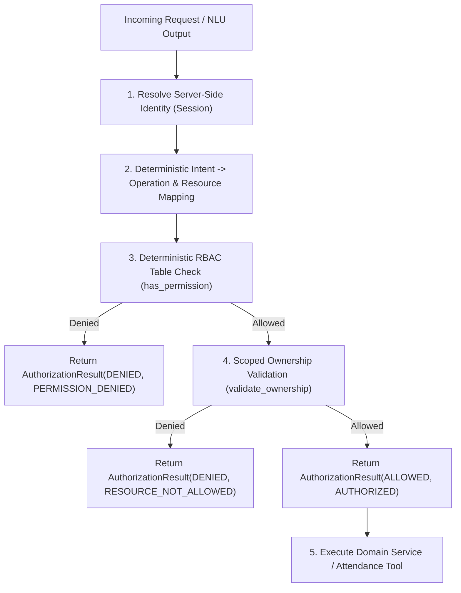

<!-- docs/authorization-report.md -->
# Deterministic Authorization Implementation Report

## 1. Executive Summary

This report documents the design, implementation, and verification of the deterministic authorization engine for the **XYZ AI** School Assistant. The authorization layer enforces zero-trust access controls, isolates LLM outputs from privilege decisions, and strictly validates resource ownership via the decoupled school domain model.

---

## 2. Authorization Assessment

### Previous State
* Basic RBAC lookup table with intent-level permissions.
* Simplified authorization guard coupling role checks with inline parameter validations.
* Server-side session store establishing identity.

### Identified Deficiencies & Opportunities
* Intent-to-operation mapping made implicit assumptions about caller roles.
* Ownership validation lacked structured resource targeting (`STUDENT`, `CLASS`).
* Minimal audit context and structured decision reporting.

---

## 3. Architecture Implemented

A unified, deterministic `AuthorizationEngine` was built with a four-stage pipeline:



---

## 4. Key Security & Architectural Enhancements

### RBAC Changes
* Hardcoded permission sets per role (`STUDENT`, `PARENT`, `TEACHER`, `PRINCIPAL`).
* Strict separation between high-level natural language intents and concrete backend operations.

### Resource Ownership Scoping
* **Students:** Access strictly limited to own records (`user_id == target_student_id`).
* **Parents:** Access dynamically resolved through `SchoolDomainService.get_children_for_parent()`.
* **Teachers:** Scoped strictly to assigned classes via `SchoolDomainService.get_classes_for_teacher()`.
* **Principals:** School-wide visibility across all student and class entities.

### Tool & Service Enforcement
* Attendance service and REST endpoints require authenticated caller identity.
* Unauthorized direct tool access attempts are rejected prior to execution.

### Attack & Threat Mitigation
* **Role Spoofing:** Ignored; caller role derived purely from verified server session.
* **Prompt Injection:** NLU interpretations cannot bypass deterministic authorization rules.
* **Resource Traversal / IDOR:** Denied via domain relationship verification.
* **Fail Closed:** Unknown or unmapped intents default to `DENIED`.

---

## 5. Artifacts & Codebase Inventory

### Files Created
* [`backend/app/authz/models.py`](file:///c:/Users/patha/OneDrive/Desktop/XYZ_ai/backend/app/authz/models.py): Data models (`AuthorizationDecision`, `AuthorizationResult`, `ResourceTarget`).
* [`backend/app/authz/engine.py`](file:///c:/Users/patha/OneDrive/Desktop/XYZ_ai/backend/app/authz/engine.py): Deterministic `AuthorizationEngine` implementation.
* [`backend/app/attendance/router.py`](file:///c:/Users/patha/OneDrive/Desktop/XYZ_ai/backend/app/attendance/router.py): Protected REST endpoints (`/api/v1/attendance`).
* [`backend/tests/test_authorization_engine.py`](file:///c:/Users/patha/OneDrive/Desktop/XYZ_ai/backend/tests/test_authorization_engine.py): Dedicated authorization unit test suite.

### Files Modified & Integrated
* [`backend/app/authz/guard.py`](file:///c:/Users/patha/OneDrive/Desktop/XYZ_ai/backend/app/authz/guard.py): Updated with `authorize_request` interface.
* [`backend/app/authz/router.py`](file:///c:/Users/patha/OneDrive/Desktop/XYZ_ai/backend/app/authz/router.py): Session-backed `/api/v1/authz/authorize` endpoint.
* [`backend/app/attendance/service.py`](file:///c:/Users/patha/OneDrive/Desktop/XYZ_ai/backend/app/attendance/service.py): Ownership and role validation guards.
* [`backend/app/main.py`](file:///c:/Users/patha/OneDrive/Desktop/XYZ_ai/backend/app/main.py): Route registration and startup domain seed initialization.
* [`docs/data-model.md`](file:///c:/Users/patha/OneDrive/Desktop/XYZ_ai/docs/data-model.md): School domain ER diagram and entity specifications.
* [`docs/architecture.md`](file:///c:/Users/patha/OneDrive/Desktop/XYZ_ai/docs/architecture.md): Layered architecture and authentication boundary details.
* [`docs/security-design.md`](file:///c:/Users/patha/OneDrive/Desktop/XYZ_ai/docs/security-design.md): Security principles and threat model documentation.

---

## 6. Verification Results

All **68 tests** across all 11 backend test suites passed:

```text
============================= test session starts =============================
platform win32 -- Python 3.13.1, pytest-9.0.2, pluggy-1.6.0
rootdir: backend
collected 68 items

tests\test_authentication.py ........                                    [ 11%]
tests\test_authorization_engine.py ..........                            [ 26%]
tests\test_authz.py ........                                             [ 38%]
tests\test_conversation.py .........                                     [ 51%]
tests\test_domain.py .........                                           [ 64%]
tests\test_health.py .                                                   [ 66%]
tests\test_nlu.py .....                                                  [ 73%]
tests\test_nlu_schema.py ....                                            [ 79%]
tests\test_ownership.py ....                                             [ 85%]
tests\test_security_boundaries.py ......                                 [ 94%]
tests\test_session_security.py ....                                      [100%]

======================= 68 passed in 5.57s =======================
```
