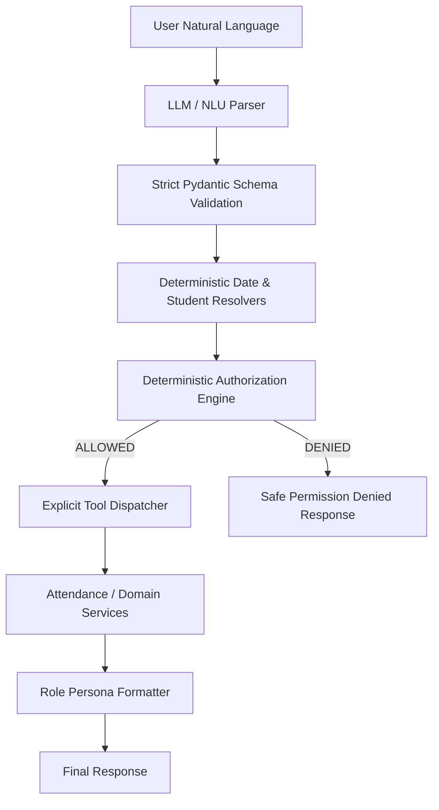

# NLU, Intent Classification, Entity Resolution & Routing Architecture

## Overview

XYZ AI employs a **Zero-Trust NLU Architecture**. The core principle of the system is:

> **The LLM interprets natural language. The application decides what is allowed.**

Under this model:
- Natural language input from users is treated strictly as untrusted data.
- The LLM cannot perform operations, call tools, inspect internal databases, or evaluate permissions.
- The LLM produces a structured [NLUResult](file:///c:/Users/patha/OneDrive/Desktop/XYZ_ai/backend/app/nlu/schemas.py) which is validated against strict Pydantic schemas (`extra="forbid"`).
- All student names, classes, and dates are resolved deterministically against verified domain records.
- Authorization decisions are computed strictly by the server-side [AuthorizationEngine](file:///c:/Users/patha/OneDrive/Desktop/XYZ_ai/backend/app/authz/engine.py) using authenticated session credentials.
- Tools are executed solely via the static, explicit [ToolDispatcher](file:///c:/Users/patha/OneDrive/Desktop/XYZ_ai/backend/app/routing/dispatcher.py).

---

## 1. Intent Taxonomy

The system defines a controlled, typed enumeration in [Intent](file:///c:/Users/patha/OneDrive/Desktop/XYZ_ai/backend/app/nlu/intents.py):

| Intent | Description | Target Roles |
|---|---|---|
| `view_own_attendance` | Student queries their own attendance | `STUDENT` |
| `view_child_attendance` | Parent queries attendance of their child | `PARENT` |
| `mark_attendance` | Teacher records student attendance | `TEACHER`, `PRINCIPAL` |
| `view_class_attendance` | Teacher queries class attendance roster | `TEACHER`, `PRINCIPAL` |
| `view_school_attendance`| Principal queries overall school attendance | `PRINCIPAL` |
| `view_school_analytics` | Principal queries analytical attendance metrics | `PRINCIPAL` |
| `greeting` | Conversational greetings (no tool call) | All Roles |
| `clarification_needed` | Ambiguous request requiring user input | All Roles |
| `unsupported_request` | Actions beyond assistant scope | All Roles |
| `escalate_to_teacher` | Forward query to human teacher | All Roles |
| `escalate_to_management`| Forward query to school administration | All Roles |
| `general_school_query` | General FAQ & calendar inquiries | All Roles |
| `unknown` | Unclassifiable input | All Roles |

---

## 2. Entity Schemas & Pydantic Validation

Entity parsing uses [NLUEntities](file:///c:/Users/patha/OneDrive/Desktop/XYZ_ai/backend/app/nlu/schemas.py) and [NLUResult](file:///c:/Users/patha/OneDrive/Desktop/XYZ_ai/backend/app/nlu/schemas.py) with `model_config = ConfigDict(extra="forbid")` to prevent LLM injection attacks.

```json
{
  "intent": "mark_attendance",
  "language": "en",
  "entities": {
    "student_id": null,
    "student_name": "Rahul",
    "class_id": null,
    "class_name": null,
    "date": "today",
    "date_range": null,
    "attendance_status": "ABSENT",
    "attendance_period": null
  },
  "missing_information": [],
  "requires_clarification": false,
  "confidence": 0.95
}
```

---

## 3. Deterministic Resolvers

### A. Date Expression Resolver ([date_resolver.py](file:///c:/Users/patha/OneDrive/Desktop/XYZ_ai/backend/app/nlu/date_resolver.py))
Converts natural language dates deterministically into `datetime.date`:
- Relative keywords: `today`, `yesterday`, `tomorrow`.
- Weekdays: `last monday`, `this friday`, `tuesday`.
- ISO & Common Formats: `YYYY-MM-DD`, `DD/MM/YYYY`, `MM/DD/YYYY`.
- Fallback: Defaults to reference date (`date.today()`) if unspecified.

### B. Student Entity Resolver ([entity_resolver.py](file:///c:/Users/patha/OneDrive/Desktop/XYZ_ai/backend/app/nlu/entity_resolver.py))
Resolves student names and IDs against domain models with strict scoping:
1. **Direct ID Match**: Exact lookup in domain student repository.
2. **Exact Full Name Match**: Exact lookup against student records.
3. **Prefix / First Name Match**: Resolves unique matches; returns `AMBIGUOUS_MATCH` if multiple students share a first name.
4. **Scoping**: When invoked for teachers, restricts search to `allowed_student_ids` in the teacher's assigned classes. When invoked for parents, restricts search to linked children.
5. **No Guessing**: Never guesses among ambiguous candidates.

---

## 4. Multi-Turn Clarification Handling

When an entity is ambiguous or missing:
- **Parent with Multiple Children**: If a parent says *"How much attendance does my child have?"*, the system checks linked children:
  - If 1 child: Automatically resolves that child.
  - If >1 children: Responds *"Sure. Which child would you like me to check — Rahul or Arjun?"* and flags `requires_clarification = True`.
  - Next Turn: Resolves the selected child and delivers verified records.
- **Ambiguous Student in Class**: If multiple students match a name query, the assistant prompts for disambiguation with candidate names.

---

## 5. Explicit Tool Dispatcher ([dispatcher.py](file:///c:/Users/patha/OneDrive/Desktop/XYZ_ai/backend/app/routing/dispatcher.py))

All tool executions are statically mapped. The system does not use `eval()`, dynamic `getattr()`, or allow the LLM to choose arbitrary tool functions.



---

## 6. Prompt Injection Defense

1. **System Prompt Hardening**: NLU instructions treat all user messages as data strings, explicitly ignoring instructions that attempt to claim roles or bypass checks.
2. **Server-Side Identity Anchor**: The LLM output has zero influence over the caller's identity. `user_id` and `role` are read directly from cryptographic session tokens.
3. **Strict Schema Constraints**: Injected keys (e.g. `"authorized": true`, `"role": "principal"`) raise validation errors and are immediately discarded.
4. **Mandatory Authorization Gate**: Even if an attacker manipulates the LLM into producing `view_school_analytics`, the `AuthorizationEngine` rejects the request because the caller's authenticated role lacks the required permission.
