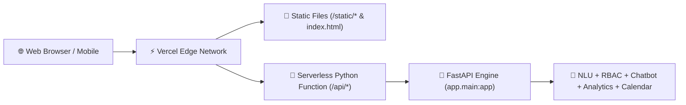

# Vercel Serverless Deployment Guide — XYZ AI

This guide walks through deploying the **XYZ AI Human-Like School Assistant** to [Vercel](https://vercel.com) using Python Serverless Functions.

---

## 🏗️ Architecture on Vercel



- **Runtime**: `@vercel/python` (Python 3.9+)
- **Serverless Adapter**: `api/index.py` mounts the full `backend/app/main.py` FastAPI app.
- **Static Assets**: Automatically served by FastAPI `StaticFiles` and Vercel Edge routing.
- **Database**: SQLite in-memory / zero-dependency fallback (or external PostgreSQL via `DATABASE_URL`).

---

## 🚀 1-Click Deployment Steps

### Step 1: Push Repository to GitHub
Ensure the latest version of your repository is on GitHub:
```bash
git push origin master
```

### Step 2: Import Project in Vercel
1. Go to [vercel.com/dashboard](https://vercel.com/dashboard).
2. Click **"Add New..."** → **"Project"**.
3. Select your GitHub repository: `EduBridge-AI-Human-Like-School-Assistant` (or `XYZ_ai`).
4. In **Framework Preset**, leave as **"Other"**.
5. In **Root Directory**, keep `./` (the root directory).

### Step 3: Configure Environment Variables (Optional)
Add any optional environment variables in the Vercel Project Settings:

| Key | Value | Description |
|-----|-------|-------------|
| `ENVIRONMENT` | `production` | Production environment flag |
| `LLM_API_KEY` | *(optional)* | Optional Gemini/OpenAI API Key for fallback generation |
| `DATABASE_URL` | *(optional)* | Optional PostgreSQL connection string (defaults to SQLite) |

### Step 4: Click "Deploy"
Vercel will automatically:
1. Detect `vercel.json` and `api/index.py`.
2. Install dependencies from `requirements.txt`.
3. Deploy your application to a global URL (e.g. `https://xyz-ai-school.vercel.app`).

---

## 🔍 Verifying the Deployment

Once deployed, visit your Vercel URL to verify all capabilities:

1. **Dashboard UI**: `https://your-app.vercel.app/`
2. **Health Check**: `https://your-app.vercel.app/health`
3. **Chatbot Health**: `https://your-app.vercel.app/api/v1/chatbot/health`
4. **Quiz API**: `https://your-app.vercel.app/api/v1/chatbot/quiz/photosynthesis`
5. **Analytics API**: `https://your-app.vercel.app/api/v1/analytics/overview`
6. **Calendar API**: `https://your-app.vercel.app/api/v1/calendar/events`
